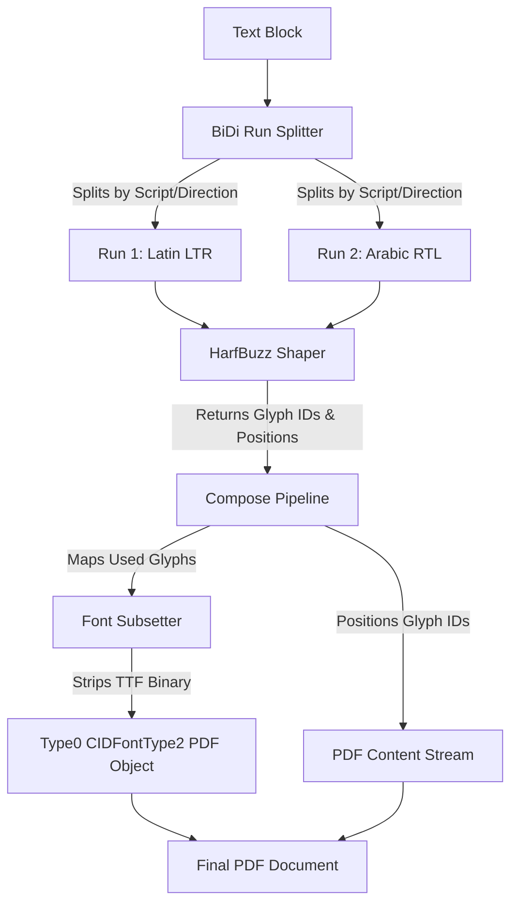

# Phase 35: Complex Text & i18n Foundations - Research

**Researched:** 2024-05-03
**Domain:** Typography, i18n, PDF Text Encoding
**Confidence:** HIGH

## Summary

To achieve robust support for mixed character sets (Arabic, CJK, Latin) and complex scripts without bloating PDF sizes, Rendro must transition from single-byte text encoding to advanced typography mechanisms. This involves a three-pronged upgrade: transitioning the PDF text encoding from `MacRomanEncoding` to CID-keyed (`Type0` / `Identity-H`) fonts, adopting HarfBuzz for proper text shaping and Bidirectional (BiDi) layout, and implementing a TrueType (TTF) font subsetter.

Because Rendro guarantees a "Pure Elixir" experience without external system dependencies (like headless Chrome), we must strategically leverage `rustler_precompiled` NIFs. The `harfbuzz_ex` library provides the necessary industry-standard text shaping engine as a precompiled binary, preventing the massive technical debt of building an OpenType shaping engine from scratch. For font subsetting, we will design a pure Elixir binary transformer that strips unused glyphs and rewrites TTF tables, keeping the core generation pipeline native and aligned with Elixir's strengths in binary pattern matching.

**Primary recommendation:** Adopt `harfbuzz_ex` for shaping and `unicode_data` for script/bidi properties to split text into runs, while implementing a pure-Elixir TTF binary subsetter (`Rendro.PDF.FontSubsetter`) to generate CID-keyed `Type0` font objects.

<user_constraints>
## User Constraints (from CONTEXT.md)

### Locked Decisions
None found.

### the agent's Discretion
- Approach to Font Subsetting (Pure Elixir vs NIF)
- Approach to BiDi / Text Shaping (Custom vs NIF)

### Deferred Ideas (OUT OF SCOPE)
None.
</user_constraints>

## Architectural Responsibility Map

| Capability | Primary Tier | Secondary Tier | Rationale |
|------------|-------------|----------------|-----------|
| BiDi Run Splitting | Pipeline (`I18n`) | Core API | Must segment multi-script/multi-directional text strings into unidirectional runs *before* shaping. |
| Text Shaping | Pipeline (`I18n`) | Core API | Translates unicode codepoint runs into precise Glyph IDs and exact physical positions (handling ligatures). |
| Font Subsetting | PDF Engine (`PDF`) | — | Processes TTF binaries at write-time to strip `glyf`/`loca` tables of unused glyphs, minimizing PDF size. |
| PDF CID-Keying | PDF Engine (`PDF`) | — | Upgrades `Writer` to emit `Type0`/`CIDFontType2` dictionaries with `Identity-H` encoding so the PDF uses Glyph IDs. |
| Fallback/Telemetry | Render Pipeline | Core API | Detects missing glyph IDs from the shaping engine and emits structured Telemetry events instead of crashing. |

## Standard Stack

### Core
| Library | Version | Purpose | Why Standard |
|---------|---------|---------|--------------|
| `harfbuzz_ex` | `~> 1.2` | Text shaping | The universal standard for OpenType text layout. Re-implementing GSUB/GPOS handling in Elixir is a multi-year, bug-prone effort. Uses `rustler_precompiled` to maintain the "no external dependencies" promise. |
| `unicode_data` | `~> 0.8.0` | Bidi/Script properties | Pure Elixir access to the Unicode Character Database (UCD). Essential for detecting script boundaries and directionality to feed correct runs into HarfBuzz. |

### Supporting
| Library | Version | Purpose | When to Use |
|---------|---------|---------|-------------|
| `rustler_precompiled` | `~> 0.7` | NIF distribution | A transparent dependency of `harfbuzz_ex`. Downloads the correct NIF for the user's OS/arch without requiring a local Rust compiler. |

### Alternatives Considered
| Instead of | Could Use | Tradeoff |
|------------|-----------|----------|
| `harfbuzz_ex` | Pure Elixir shaping | Building a native OpenType layout engine is overwhelmingly complex. HarfBuzz handles thousands of edge cases for complex scripts like Arabic and Thai. |
| Pure Elixir Subsetter | Rust NIF Subsetter | An Elixir subsetter keeps Rendro more "native" and is highly feasible using Elixir's binary parsing. A Rust NIF would be faster to develop but adds another NIF dependency. Given Rendro already has a native `FontParser`, building `FontSubsetter` natively is recommended. |

**Installation:**
```bash
mix deps.add harfbuzz_ex "~> 1.2"
mix deps.add unicode_data "~> 0.8.0"
```

## Architecture Patterns

### System Architecture Diagram



### Recommended Project Structure
```text
lib/rendro/
├── i18n/
│   ├── bidi.ex             # Segments strings by direction and script using unicode_data
│   ├── shaper.ex           # Wrapper around harfbuzz_ex returning glyphs and bounding boxes
│   └── analyzer.ex         # (Existing) Fallback and diagnostic logic
└── pdf/
    ├── font_subsetter.ex   # Pure Elixir TTF binary transformer (rewrites glyf/loca tables)
    ├── cid_font.ex         # Generates PDF dictionaries for Type0 / Identity-H fonts
    └── ...
```

### Pattern 1: CID-Keyed (Type0) Fonts for PDF
**What:** PDF 1.4 requires `Type0` fonts with `Identity-H` encoding to support character sets beyond the standard 256-glyph Latin table.
**When to use:** Required for all embedded TrueType/OpenType fonts rendering CJK, Arabic, or complex scripts.
**Example:**
Instead of `Encoding: /MacRomanEncoding` and text `(Hello)`, Rendro's `Writer` must generate:
```elixir
<<
  /Type /Font
  /Subtype /Type0
  /BaseFont /Arial
  /Encoding /Identity-H
  /DescendantFonts [ << /Type /Font /Subtype /CIDFontType2 ... >> ]
>>
```
Inside the content stream, text is written as Hex encoded Glyph IDs (e.g., `<001B001C>`) instead of literal strings.

### Anti-Patterns to Avoid
- **Assuming 1 Codepoint = 1 Glyph:** In Arabic and Indic scripts, multiple codepoints combine into a single ligature glyph, or one codepoint splits into multiple glyphs. Measurement pipelines cannot rely on `String.length/1` or `String.graphemes/1`. They must rely purely on the shaper's returned glyph bounding boxes.
- **Applying HarfBuzz to Mixed-Direction Text:** HarfBuzz does not perform the UBA (Unicode Bidirectional Algorithm). It expects runs of a single script and direction. You MUST split the string into runs using `unicode_data` properties before passing to HarfBuzz.

## Don't Hand-Roll

| Problem | Don't Build | Use Instead | Why |
|---------|-------------|-------------|-----|
| Text Shaping | Pure Elixir GSUB/GPOS parser | `harfbuzz_ex` | OpenType layout rules are enormously complex and require years of refinement to correctly shape Thai, Arabic, and Devanagari. |
| Unicode Properties | Custom binary searches | `unicode_data` | Maintaining UCD property tables manually is tedious; existing libraries provide fast, macro-compiled guard checks. |

## Common Pitfalls

### Pitfall 1: BiDi Run Splitting Before Shaping
**What goes wrong:** Arabic text renders backward or disconnected; Latin text inside Arabic renders backward.
**Why it happens:** Passing a full string containing Latin and Arabic directly to a shaper without explicitly splitting runs and setting the direction flag (`hb_direction_t`).
**How to avoid:** Use `unicode_data` to iterate the string, chunk by script/direction boundaries, and shape each chunk individually with its explicit direction.

### Pitfall 2: Glyph IDs vs Codepoints in PDF
**What goes wrong:** The generated PDF displays incorrect characters or blank spaces.
**Why it happens:** When using `Identity-H` encoding, the PDF text operator (`Tj`) expects **Glyph IDs** (mapped via the font's internal `cmap`), not standard Unicode codepoints.
**How to avoid:** Always map text through HarfBuzz to get the exact Glyph ID. Convert these 16-bit IDs to hex strings (`<...>` instead of `(...)`) in the PDF content stream.

### Pitfall 3: Subsetting Corrupts Font Tables
**What goes wrong:** PDF viewers crash or silently fail to display the subsetted font.
**Why it happens:** Stripping `glyf` tables requires meticulously updating `loca` byte offsets, `maxp` counts, `hmtx` widths, and recalculating the whole-font checksum. Failing to keep these aligned corrupts the TTF.
**How to avoid:** Implement strict binary generation and checksum calculation `sum32` logic for the TTF directory after rewriting tables.

## Code Examples

### Text Shaping (Conceptual with harfbuzz_ex)
```elixir
# Create a Harfbuzz buffer
buffer = Harfbuzz.Buffer.new()
Harfbuzz.Buffer.add_utf8(buffer, "مرحبا")
Harfbuzz.Buffer.set_direction(buffer, :rtl)
Harfbuzz.Buffer.set_script(buffer, :arabic)

# Shape against a loaded font
Harfbuzz.shape(font, buffer, [])

# Extract Glyph IDs and advance widths
infos = Harfbuzz.Buffer.get_glyph_infos(buffer)
positions = Harfbuzz.Buffer.get_glyph_positions(buffer)
```

## State of the Art

| Old Approach | Current Approach | When Changed | Impact |
|--------------|------------------|--------------|--------|
| MacRomanEncoding | Type0 / CIDFontType2 + Identity-H | Always for CJK / i18n | Required for any global typography support in PDFs. Changes how text streams are encoded. |
| Embedded Whole Fonts | Subsetted Fonts | Modern generation | Prevents multi-megabyte PDFs when using large CJK fonts like Noto Sans SC. |

## Open Questions

1. **Pure Elixir TTF Subsetting Implementation**
   - Status: RESOLVED
   - We will proceed with the pure Elixir TTF subsetter using binary parsing `Rendro.PDF.FontSubsetter`, following the established patterns in `lib/rendro/pdf/font_parser.ex`. A spike task is not required; the planner will create a standard task mapped to the `FontParser` analog.

## Environment Availability

| Dependency | Required By | Available | Version | Fallback |
|------------|------------|-----------|---------|----------|
| `rustler_precompiled` | `harfbuzz_ex` | ✓ | — | Handled transparently by mix |
| External C Compiler | `harfbuzz_ex` | ✗ | — | Not needed due to precompiled NIFs |

## Validation Architecture

### Test Framework
| Property | Value |
|----------|-------|
| Framework | ExUnit |
| Config file | `test/test_helper.exs` |
| Quick run command | `mix test` |
| Full suite command | `mix test` |

### Phase Requirements → Test Map
| Req ID | Behavior | Test Type | Automated Command | File Exists? |
|--------|----------|-----------|-------------------|-------------|
| REQ-01 | Mixed char sets shaped correctly | integration | `mix test test/rendro/i18n/shaper_test.exs` | ❌ Wave 0 |
| REQ-02 | PDF size remains small via subsetting | integration | `mix test test/rendro/pdf/subsetter_test.exs` | ❌ Wave 0 |
| REQ-03 | Missing glyphs emit Telemetry | unit | `mix test test/rendro/i18n/shaper_telemetry_test.exs` | ❌ Wave 0 |

### Wave 0 Gaps
- [ ] `test/rendro/i18n/shaper_test.exs` — verifies correct glyph and advance extraction.
- [ ] `test/rendro/pdf/subsetter_test.exs` — verifies TTF table stripping and PDF checksumming.
- [ ] `test/support/complex_fonts.ex` — shared fixtures for CJK/Arabic tests to avoid checking in massive fonts.
